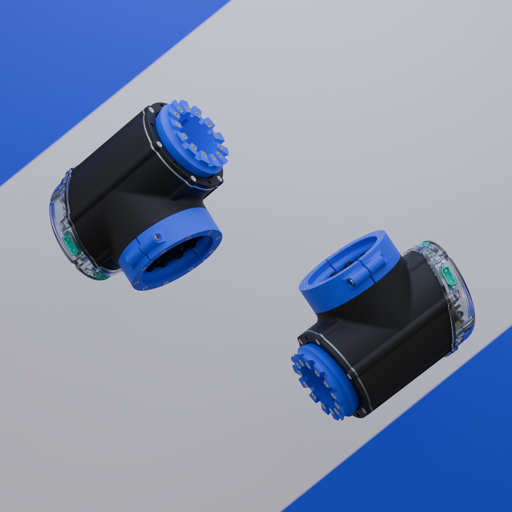

# CORA

Collaborative Open Robotic Arms

## About

CORA is a project started by students at TU Delft and members of [RSA Delft](https://www.rsadelft.nl/).
The platform aims to provide a standard robotic joint library so users can mix and match different joint types together. Instead of creating custom manipulators from scratch, researchers or makers can use our platform to drastically speed up their development cycle.

## Repositories

- [cora_common](https://github.com/C-O-R-A/cora_common) contains main robot software
- [cora_desktop](https://github.com/C-O-R-A/cora_desktop) packages for gazebo simulation
- [cora_robot](https://github.com/C-O-R-A/cora_robot) hardware communication packages
- [codi](https://github.com/C-O-R-A/codi) python sdk for commanding the robot
